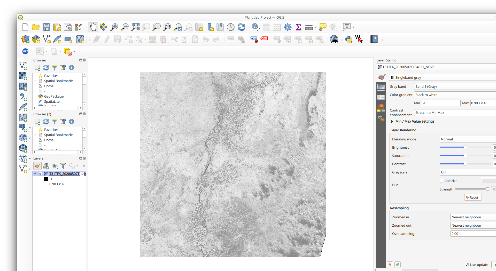

# Use Case Scenario #1 - NDVI mapping - Integration Procedures (Google Earth Engine)

## Set up your Earth Engine enabled Cloud Project

To access the Earth Engine API without using either the Code Editor, command line tool, or Python client API (i.e., by calling ee.Authenticate()) to authenticate, you will need to have a Google Cloud Project and enable the Earth Engine API for that project.

-   [Earth Engine setup](https://developers.google.com/earth-engine/earthengine_cloud_project_setup)


1. Apply for Earth Engine  
2. Create a Google Cloud project  
3. Enable the Earth Engine API on the project  
4. Create and register a service account  
	1. Create a service account  
	2. Create a private key for the service account (privatekey.json)  
	3. Register the service account to use Earth Engine  
	**NOTE: You will not be able to use the service account to access the Earth Engine API until you have received a confirmation email that the service account is registered.**

## Development Environment installation procedure

1. Provision a virtual machine on the target site. Preferably with the following specification
    - 1 CPU, 2GB RAM, 100GB disk
    - debian or similar (ubuntu)
    - with data offer access if required
  
2. Open a terminal on the provisioned machine

3. Check that python is available

```console
$ which python3
/usr/bin/python3
$ python3 --version
Python 3.7.4
```

   - if python is not available, install it with the package manager and do point 3. again

```console
$ sudo apt-get install python3
```

4. [Install the Google Earth Engine Python API](https://developers.google.com/earth-engine/python_install)

```console
$ pip install earthengine-api
```

5. [Test the service account](https://developers.google.com/earth-engine/service_account#use-the-service-account)
	
6. Create the config.py file

```console
$ vi config.py

#!/usr/bin/env python
# Lint as: python3
"""An example config.py file."""

import ee

# The service account email address authorized by your Google contact.
# Set up a service account as described in the README.
EE_ACCOUNT = '*****@developer.gserviceaccount.com'

# The private key associated with your service account in JSON format.
EE_PRIVATE_KEY_FILE = 'privatekey.json'

EE_CREDENTIALS = ee.ServiceAccountCredentials(EE_ACCOUNT, EE_PRIVATE_KEY_FILE)
```

## Integration procedure 

1. Open a terminal on the previously set-up virtual machine [10%]

2. Upload the current use case folder to the user folder using either SCP or the provider upload tool [20%]

3. Run the NDVI script `ndvi_gee.py` [40%]

```console
$ python ndvi_gee.py
```

4. Wait for the processing to complete [60%]

5. On Google Drive, check in the directory ES01_results. You should find a `tif` file with name ending with `_NDVI.tif` [80%]  
	**NOTE: Export to Google Drive from Python API currently NOT working!**
	
6. Download it to your computer and open it with QGIS [100%]



## Application build procedure (TODO) 

1. Open a terminal on the previously set-up virtual machine

2. Go to the Use case folder

3. Launch docker build prefixing the name with the target site docker hub repository (here docker.terradue.com)

```console
$ docker build -t docker.terradue.com/cdab-ndvi-gee .
```

4. Push the docker to the hub

```console
$ docker push docker.terradue.com/cdab-ndvi-gee
```